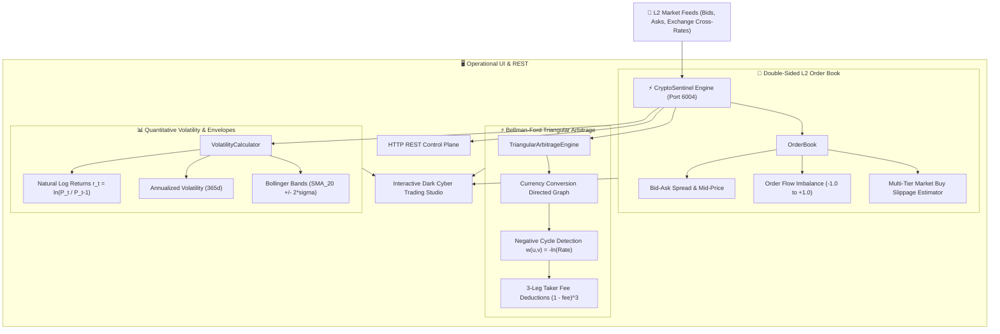

# 📈 CryptoSentinel
> **Quantitative Algorithmic Market Engine, L2 Order Book Depth & Bellman-Ford Triangular Arbitrage**  
> *Developed autonomously by the 7-Agent SDLC Software Factory for [Ali Nurettin Demir](https://github.com/alinurettin)*

[]()
[]()
[]()
[]()
[](https://opensource.org/licenses/MIT)

---

## 🌟 Executive Summary & Engineering Value
**CryptoSentinel** is a high-frequency quantitative market analysis and cross-pair arbitrage engine engineered strictly from first principles with zero external runtime dependencies. It models double-sided Level 2 (L2) order books, estimates multi-tier market order slippage, computes annualized log-return volatility and Bollinger Bands, and discovers risk-free triangular arbitrage cycles using the **Bellman-Ford negative cycle theorem** with full deduction of maker/taker exchange fees.

---

## 🏗️ System Architecture & Quantitative Pipeline



---

## 🔬 Mathematical Formulations

### 1. Triangular Arbitrage as Negative Log Cycle
In financial graph theory, discovering cross-rate currency arbitrage is mapped to finding a directed cycle where the product of exchange rates exceeds 1. By transforming edge rates $R_{u,v}$ to negative logarithms:
$$w(u, v) = -\ln(R_{u, v})$$
A profitable arbitrage path corresponds exactly to a negative weight cycle:
$$\prod_{i=1}^{k} R_i > 1 \iff \sum_{i=1}^{k} -\ln(R_i) < 0$$
Accounting for exchange trading fees ($\phi = 0.075\%$ per leg):
$$\text{Net Multiplier} = \left(\prod_{i=1}^{k} R_i\right) \cdot (1 - \phi)^k$$
$$\text{Net Profit \%} = (\text{Net Multiplier} - 1) \times 100$$

### 2. Order Book Imbalance Ratio
Measures whether limit order volume is predominantly buy-side or sell-side across the top $N$ book tiers:
$$\text{Imbalance} = \frac{\sum_{i=1}^{N} V_{\text{bid}, i} - \sum_{i=1}^{N} V_{\text{ask}, i}}{\sum_{i=1}^{N} V_{\text{bid}, i} + \sum_{i=1}^{N} V_{\text{ask}, i}} \in [-1.0, 1.0]$$
- $\text{Imbalance} > 0$: Bullish limit order pressure
- $\text{Imbalance} < 0$: Bearish limit order pressure

### 3. Log-Returns & Bollinger Bands
Continuous compounding log returns:
$$r_t = \ln\left(\frac{P_t}{P_{t-1}}\right)$$
Bollinger Bands over a 20-period simple moving average ($\text{SMA}_{20}$):
$$\text{Middle} = \mu_{20}, \quad \text{Upper} = \mu_{20} + 2\sigma, \quad \text{Lower} = \mu_{20} - 2\sigma$$
$$\text{Bandwidth \%} = \frac{\text{Upper} - \text{Lower}}{\text{Middle}} \times 100$$

---

## 🔌 API Specification & REST Endpoints

### 1. Level 2 Order Book Depth
```bash
curl -X GET http://localhost:6004/api/orderbook?symbol=BTC/USDT
```
**Response:**
```json
{
  "success": true,
  "symbol": "BTC/USDT",
  "bids": [{"price": 65420.0, "amount": 1.45}, ...],
  "asks": [{"price": 65425.0, "amount": 0.95}, ...],
  "spread": {
    "bestBid": 65420.0,
    "bestAsk": 65425.0,
    "absolute": 5.0,
    "percentage": 0.0076
  },
  "imbalance": 0.1824
}
```

### 2. Simulate Market Order Slippage
```bash
curl -X POST http://localhost:6004/api/orderbook/slippage \
  -H "Content-Type: application/json" \
  -d '{"symbol": "BTC/USDT", "amount": 2.5}'
```

### 3. Scan Triangular Arbitrage Cycles
```bash
curl -X GET http://localhost:6004/api/arbitrage/triangular?capital=10000
```
**Response:**
```json
{
  "success": true,
  "initialCapital": 10000,
  "takerFeePct": 0.075,
  "opportunitiesCount": 4,
  "cycles": [
    {
      "path": ["USDT", "BTC", "ETH", "USDT"],
      "initialCapital": 10000,
      "finalCapital": 10072.45,
      "netMultiplier": 1.007245,
      "profitPct": 0.7245,
      "profitable": true
    }
  ]
}
```

### 4. Volatility & Bollinger Bands
```bash
curl -X GET http://localhost:6004/api/volatility?symbol=BTC/USDT
```

---

## 🧪 Comprehensive Verification Suite (100% Non-Mocked)

Run the verification suite executing all 47 assertions across order book matching, negative cycle arbitrage, quantitative volatility, and ephemeral HTTP:

```bash
npm test
```

### Test Coverage Highlights:
- **Order Book Dynamics (11 tests):** Best bid/ask selection, spread percentage calculation, mid-price calculation, order flow imbalance, and multi-tier slippage walk.
- **Bellman-Ford Triangular Arbitrage (9 tests):** Closed loop validation, 3-leg fee deduction, profit percentage, unprofitable reverse cycles, and opportunity sorting.
- **Quantitative Volatility (8 tests):** Log-returns calculation, sample standard deviation, annualized volatility scaling, and Bollinger Band envelope invariants.
- **Live HTTP Server (19 tests):** Ephemeral port negotiation, REST endpoints, rate configuration, and standard HTTP 404 handling.

---

## 🐳 Docker Deployment

Run with Docker Compose:
```bash
docker compose up -d --build
```
Access the interactive dashboard at `http://localhost:6004`.

---

## 📜 License
MIT License &copy; 2026 Ali Nurettin Demir (@alinurettin).
